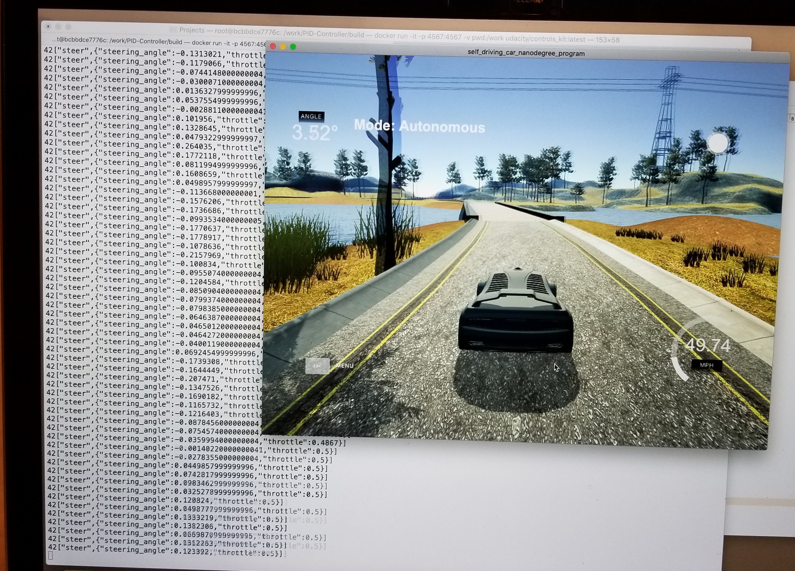

#PID Controller
This is a reflection of the the project PID controller.

###Describe the effect each of the P, I, D components had in your implementation.

Here are the components of a PID controller:

* P (proportional). Propotional component is related with the present value of the error. It proportionally impacts the controller. If the error is large and positive, the control output will also be large and positive.

* I (integral). Integral component is the sum of all past values of the errors. This reduces the sudden change of a current value. 

* D (differential). Differential represents the rate of change of the errors.

In designing a PID controller, we use a co-efficient for each of the components and the error values. For example, Let

Kp = coefficient of Proportional
Ki = coefficient of Integral
Kd = coefficient of Differential

p_error = proportional error
i_error = integratal error
d_error = differential error

Then PID controller output = - Kp * p_error - Ki * i_error - Kd * d_error
 
###Describe how the final hyperparameters were chosen

I have started from the default parameters used in the video lesson and then tune it manually in this project. I have used two controllers. One for the steering value and one for controlling the speed. I have implemented a Tweddle but unable to use it to get the right parameters.

The following parameters work well in this project:

Steering PID controller:

* P = 0.2
* I = 0.003
* D = 3.0

Throlle PID Controller:
 
* P = 0.4
* I = 0
* D = 0.5

I have attached a video to showcase how the PID controller works:

